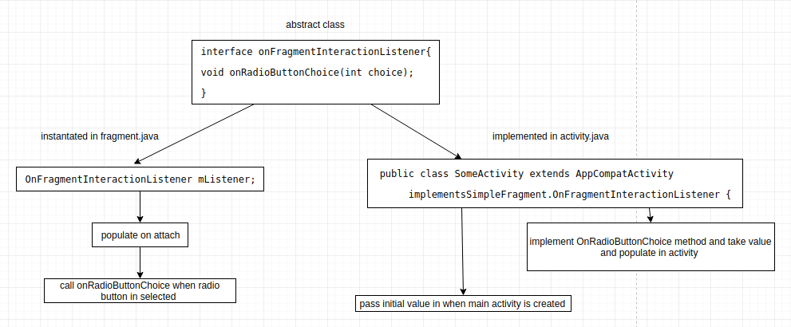

# Fragments

A reusable component which can be added statically or dynamically to an activity. 

Statically added fragments remains in activity throughout its lifetime

A fragment has:

* constructor
* onCreateView -- inflater.inflate
  
[static example:](https://codelabs.developers.google.com/codelabs/advanced-android-training-fragments/index.html?index=..%2F..advanced-android-training#2)


```java
public class SimpleFragment extends Fragment {
    // fragments specific private and public members
    public SimpleFragment() {
        // Required empty public constructor
    }

    /**
     * Creates the view for the fragment.
     * @param inflater           LayoutInflater
     * @param container          ViewGroup
     * @param savedInstanceState Bundle
     * @return View
     */
    @Override
    public View onCreateView(LayoutInflater inflater, ViewGroup container,
                             Bundle savedInstanceState) {
        // Inflate the layout for this fragment.
        final View fragmentRootView = inflater.inflate(R.layout.fragment_simple,
                container, false);
        // If fragment has has radio button handle this
        final RadioGroup radioGroup = fragmentRootView.findViewById(R.id.radio_group);

        // Set the radioGroup onCheckedChanged listener.
        radioGroup.setOnCheckedChangeListener(
            ...
        });

        // Return the View for the fragment's UI.
        return fragmentRootView;
    }
```

[dynamic example:](https://codelabs.developers.google.com/codelabs/advanced-android-training-fragments/index.html?index=..%2F..advanced-android-training#4)


create below routine in fragment.java to instantiate new fragment in activity.java

```java
    ...
    public static SimpleFragment newInstance() {
        return new SimpleFragment();
    }
    ...
```

```java
public class MainActivity extends AppCompatActivity {
    ...
    static final String STATE_FRAGMENT = "state_of_fragment";

    @Override
    protected void onCreate(Bundle savedInstanceState) {
        ...
        if (savedInstanceState != null) {
            isFragmentDisplayed = savedInstanceState.getBoolean(STATE_FRAGMENT);
            if (isFragmentDisplayed) {
                // If the fragment is displayed, change button to "close".
                mButton.setText(R.string.close);
            }
        }
        // Set the click listener for the button.
        mButton.setOnClickListener(new View.OnClickListener() {
            @Override
            public void onClick(View view) {
                if (!isFragmentDisplayed) {
                    displayFragment();
                } else {
                    closeFragment();
                }
            }
        });
    }

    /**
     * This method is called when the user clicks the button
     * to open the fragment.
     */
    public void displayFragment() {
        // Instantiate the fragment.
        SimpleFragment simpleFragment = SimpleFragment.newInstance();
        // Get the FragmentManager and start a transaction.
        FragmentManager fragmentManager = getSupportFragmentManager();
        FragmentTransaction fragmentTransaction = fragmentManager
                .beginTransaction();

        // Add the SimpleFragment.
        // replacing frame layout with fragment.
        fragmentTransaction.add(R.id.fragment_container,
                simpleFragment).addToBackStack(null).commit();

        // Update the Button text.
        mButton.setText(R.string.close);
        // Set boolean flag to indicate fragment is open.
        isFragmentDisplayed = true;
    }

    /**
     * This method is called when the user clicks the button to
     * close the fragment.
     */
    public void closeFragment() {
        // Get the FragmentManager.
        FragmentManager fragmentManager = getSupportFragmentManager();
        // Check to see if the fragment is already showing.
        // checking if frame layout is replaced with fragment.
        SimpleFragment simpleFragment = (SimpleFragment) fragmentManager
                .findFragmentById(R.id.fragment_container);
        if (simpleFragment != null) {
            // Create and commit the transaction to remove the fragment.
            FragmentTransaction fragmentTransaction =
                    fragmentManager.beginTransaction();
            fragmentTransaction.remove(simpleFragment).commit();
        }
        // Update the Button text.
        mButton.setText(R.string.open);
        // Set boolean flag to indicate fragment is closed.
        isFragmentDisplayed = false;
    }

    public void onSaveInstanceState(Bundle savedInstanceState) {
        // Save the state of the fragment (true=open, false=closed).
        savedInstanceState.putBoolean(STATE_FRAGMENT, isFragmentDisplayed);
        super.onSaveInstanceState(savedInstanceState);
    }
```

## communication between activity and fragment



changes in activity.java
```java
public class MainActivity extends AppCompatActivity
        implements SimpleFragment.OnFragmentInteractionListener {

    ...
    private boolean isFragmentDisplayed = false;
    ...
    private int mRadioButtonChoice = 2;


    /**
     * This method is called when the user clicks the button
     * to open the fragment.
     */
    public void displayFragment() {
        // Instantiate the fragment by passing initial value to constructor
        SimpleFragment simpleFragment =
                SimpleFragment.newInstance(mRadioButtonChoice);
        ...
    }
    /**
     * This method keeps in memory the radio button choice the user selected
     * and displays a Toast to show it.
     *
     * @param choice The user's radio button choice.
     */
    @Override
    public void onRadioButtonChoice(int choice) {
        // Keep the radio button choice to pass it back to the fragment.
        mRadioButtonChoice = choice;
        // Show a Toast with the radio button choice.
        Toast.makeText(this, "Choice is " + Integer.toString(choice),
                LENGTH_SHORT).show();
    }

}
```

changes in fragments.java

```java
public class SimpleFragment extends Fragment {

    // The listener interface.
    OnFragmentInteractionListener mListener;

    interface OnFragmentInteractionListener {
        void onRadioButtonChoice(int choice);
    }

    /**
     * This method checks if the hosting activity has implemented
     * the OnFragmentInteractionListener interface. If it does not,
     * an exception is thrown.
     *
     * @param context
     */
    @Override
    public void onAttach(Context context) {
        super.onAttach(context);
        if (context instanceof OnFragmentInteractionListener) {
            mListener = (OnFragmentInteractionListener) context;
        } else {
            throw new ClassCastException(context.toString()
                    + getResources().getString(R.string.exception_message));
        }
    }

    @Override
    public View onCreateView(LayoutInflater inflater, ViewGroup container,
                             Bundle savedInstanceState) {
        // Inflate the layout for this fragment
        final View rootView = inflater.inflate(R.layout.fragment_simple,
                container, false);
        final RadioGroup radioGroup = rootView.findViewById(R.id.radio_group);

        // If user reopens the fragment after making a choice, the bundle
        // contains "choice".
        if (getArguments().containsKey(CHOICE)) {
            // A choice was made, so get the choice.
            mRadioButtonChoice = getArguments().getInt(CHOICE);
            // Check the radio button choice.
            if (mRadioButtonChoice != NONE) {
                radioGroup.check
                        (radioGroup.getChildAt(mRadioButtonChoice).getId());
            }
        }

        // Set the radioGroup onCheckedChanged listener.
        radioGroup.setOnCheckedChangeListener(
            ...
            switch (index) {
                case YES: // User chose "Yes".
                    textView.setText(R.string.yes_message);
                    mRadioButtonChoice = YES;
                    // passing value to main activity
                    mListener.onRadioButtonChoice(YES);
                    break;
            }
            ...
        );

    public static SimpleFragment newInstance(int choice) {
        SimpleFragment fragment = new SimpleFragment();
        Bundle arguments = new Bundle();
        arguments.putInt(CHOICE, choice);
        fragment.setArguments(arguments);
        return fragment;
    }
}
```